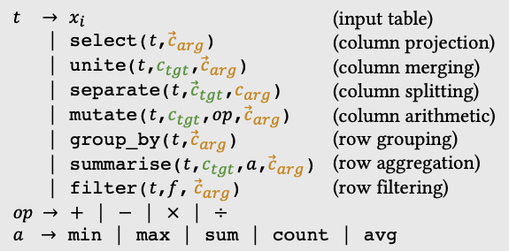
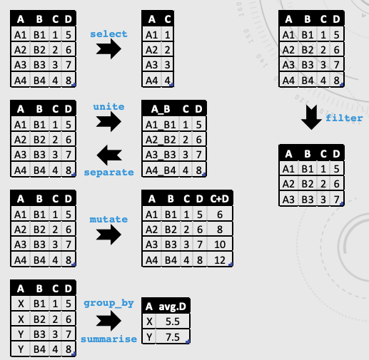
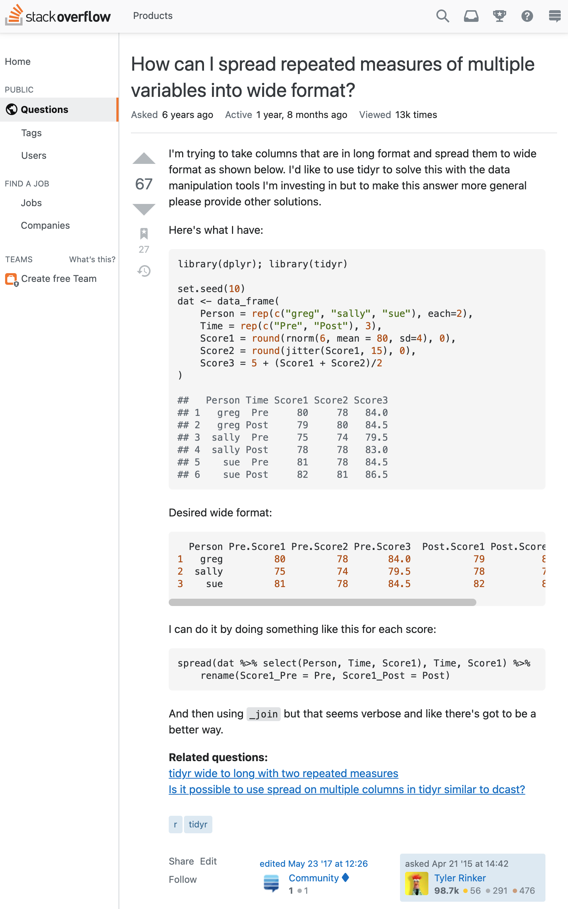

# Homework Assignment 3

**Due Monday, May 26, 2021 at 11:59pm (Pacific Time)**

In this homework, you will be using Trinity ([https://github.com/fredfeng/Trinity](https://github.com/fredfeng/Trinity)) to build a multi-modal synthesizer for data science.

Note: If you are passionate in programming languages techniques and are open to challenges, I have inserted some slightly more challenging problems and tips (which are marked with the cowboy face 🤠). These problems will ***NOT*** count into any of your final scores, but just for those who want to explore more of this domain. Enjoy!

## Submission

Please submit the solution files via gradescope.

In this homework, you only need to submit the following files:

- `task1-1.log` required by Problem 1, Task 1-1
- `task1-2.txt` required by Problem 1, Task 1-2
- `task2-1.log` required by Problem 2, Task 2-1
- `task2-2.log` required by Problem 2, Task 2-2
- `task3.txt` required by Problem 3

Note: You should be fairly familiar with the basic usage of the Trinity framework. If not, you can revisit HW1 of this course. For this homework, we will add a customized extension, a neural network, to the synthesizer built using Trinity, and use the network to account for user specification written in natural language, besides input-output examples. This process does require you to spend some time to read and understand the code and overall approach a bit in order to answer the homework questions and fill in the holes. If you happened to struggle a lot more than expected, it could be my problem on stating the questions, and please don't hesitate to reach out to us about your confusions, via Slack, office hours or emails.

## Problem Overview: Multi-Modal Synthesis Using Trinity

In this homework, we will explore program synthesis on data science domain, using a pre-defined Trinity client for synthesizing programs written in Morpheus DSL. Morpheus is a DSL that performs various core data wrangling operations, whose syntax and semantics are originally adapted from the core of `tidyr` and `dplyr` packages of the R language. 

🤠: See [here](https://fredfeng.github.io/papers/pldi17-extend.pdf) if you are interested in details of Morpheus.

The following shows part of the Morpheus grammar that this homework is going to use (**hereinafter referred to as "Morpheus"**):

<p align="center">
  
  <br>
    <em>Grammar of a subset of the Morpheus DSL. Adapted from <a href="https://sites.cs.ucsb.edu/~yanju/misc/MAE.pdf">here</a>.</em>
</p>

As we can see, the Morpheus DSL includes different kinds of operations for data science, such as projections, mutations and aggragations. You can find some more illustrative examples showing the semantics of every component by the following:

<p align="center">
  
  <br>
    <em>Examples showing concrete semantics of Morpheus DSL. Adapted from <a href="https://sites.cs.ucsb.edu/~yanju/misc/MAE.pdf">here</a>.</em>
</p>

For a typical program synthesis question in data science, a user can usually provide an input-output example that describes her intentions, as well as some alternate helping texts (in natural language) that further strengthen the specifications.

Let's take a look at a real question from StackOverflow: [Question#29775461](https://stackoverflow.com/questions/29775461/how-can-i-spread-repeated-measures-of-multiple-variables-into-wide-format). In the following snapshot of this question, the user not only provides a concrete input-output example, but also writes some useful descriptions in natural language that provide quite strong hints about what the desired solution should approximately look like.

<p align="center">
  
  <br>
    <em>A snapshot of StackOverflow question 29775461.</em>
</p>

Usually a synthesizer only takes into account of one form of specification. For example, in HW1 we implemented a synthesizer that only takes into string manipulation input-output examples. But in many real-world cases, specifications come with multiple modalities, which requires multi-modal synthesis.

So we will extend the current Morpheus client in Trinity to also take natural language descriptions as part of the inputs, and use that to bias the search process during synthesis, so that the synthesizer can find the desired solution more quickly.

## Problem 1 (30%): Setting up R Environment and Client

Note: This homework requires a Python version of 3.x, preferrably 3.6+. The following instructions assume you are using Python 3.6+.

#### Configuring R Environment

Before running the Morpheus client, we have to make sure we have the R environment and its Python wrapper `rpy2` are correctly configured.

For setting up the R environment, you can follow [this guide](https://www.datacamp.com/community/tutorials/installing-R-windows-mac-ubuntu). Note that we only need the R runtime, while the RStudio mentioned in the guide is optional for this homework (but it gives you a better interactive shell for writing/debugging in R and data visualization). After you verify you have successfully configured the R environment, install the `tidyr` and `dplyr` packages via the following commands in R environment:

```R
install.packages(c("dplyr","tidyr","compare"))
```

You will probably see some error/warning messages popped up, which are usually benign. After the installation is done, try to verify it by importing those packages:

```R
library(dplyr)
library(tidyr)
```

You will probably see the following output message:

```
Attaching package: ‘dplyr’

The following objects are masked from ‘package:stats’:

    filter, lag

The following objects are masked from ‘package:base’:

    intersect, setdiff, setequal, union
```

which usually means your configuration is good. But if you see messages other than this, then probably something is wrong with your configuration.

#### Installing Python R Wrapper

The current Morpheus client in Trinity is written in Python. In order for Python to call and use R functionalities, a wrapper is needed. In particular, the `rpy2` package of version `3.0.5` is required. You can get it using `pip`:

```bash
pip install rpy2==3.0.5
```

#### Task 1-1 (20%): Testing Basic Morpheus Client

Clone the Trinity repo and switch to the `CS190I-HW3` branch:

```bash
git clone https://github.com/fredfeng/Trinity.git
cd Trinity/
git checkout CS190I-HW3
```

Then directly execute the Morpheus client `morpheus_enumerator.py` from the repo's root:

```bash
python ./morpheus_enumerator.py --input0 ./benchmarks/morpheus/3/r3_input1.csv --output ./benchmarks/morpheus/3/r3_output1.csv --length 3
```

This will try to synthesize a solution for the aforementioned StackOverflow question, using Morpheus DSL, with additional deductions (e.g., conflict-driven learning from [Neo](https://fredfeng.github.io/papers/pldi18-neo.pdf)). The provided arguments specify the input dataframe, output dataframe, as well as the desired size of the program.

Redirect all the output of running the previous command to a log file called `task1-1.log` and submit it. You should log all the standard, debugging and error outputs.

> Hint: You can make use of the `>` operator in your terminal.
>
> Hint: Trinity outputs to different streams. You can do `2>&1` to captures all the output channels.

#### Task 1-2 (10%): Code Understanding and Analysis

Analyze the code and outputs in this problem, **<u>*briefly*</u>** provide your answers/thoughts to the following questions:

1. Does the client always follow the same order of enumeration? I.e., are the outputs of the log files always the same across multiple runs?
2. According to your understanding of the code, what decides the enumeration order?

Submit your answers/thoughts via a file called `task1-2.txt`.

## Problem 2 (40%): Adding Neural Network Extension

As you may have already seen that the Morpheus client from problem 1 is still runnning a bit slow, now in this problem we will try to introduce a neural network extension so that the synthesizer can take into account of the natural language hints provided by the user to further speed up the synthesis process.

🤠: The add-on neural network is part of the Mars framework. See [here](https://fredfeng.github.io/papers/fse19-mars.pdf) for more details.

#### Configuring Neural Network Environment

We use PyTorch to build and evaluate our neural model. So if you haven't got one, you can follow the [official PyTorch tutorial](https://pytorch.org/get-started/locally/) to get one. Note that problem 2 requires a PyTorch of version 1.4+ (preferrably).

Additionally, since we are dealing with natural language, the extension utilizes the spaCy module for natural language normalization. You can configure spaCy by following its [official documentation](https://spacy.io/usage).

To test whether the environment works, redirect to the repo root directory, start a Python REPL, and simply type:

```python
import mars
```

If you see the following output:

```
use_cuda: False
```

then your environment is good to go. Note that you may also see `use_cuda: True` if you've got a GPU and have configured CUDA. But for this problem, having GPU and CUDA configured is optional and won't affect the major tasks.

#### Task 2-1 (20%): Testing Extended Morpheus Client

The main entrance to the extended Morpheus client is `app_main.py`. Simply run it by:

```bash
python ./app_main.py
```

Redirect all its output to a log file called `task2-1.log` and submit it. You should log all the standard, debugging and error outputs.

#### Task 2-2 (20%): Testing Extended Morpheus Client (Baseline)

The default setting of the `app_main.py` has turned on the neural network extension. Read the code and comments, and try to turn off the neural network extension. Run this baseline client without neural network extension and redirect all its output to a log file called `task2-2.log` and submit it. You should log all the standard, debugging and error outputs.

> Hint: No heavy coding is required. You only need to slightly modify the `app_main.py` file and run it again.

## Problem 3 (30%): Comparison and Result Analysis 

Notation: we hereinafter refer the client with neural network *enabled* as the "extended" version, and the one with neural network *disabled* as the "baseline" version.

Compare and analyze the two log files from problem 2 and try to **<u>*briefly*</u>** answer the following questions:

1. (10%) Do the two versions both generate the desired correct solutions? According to your observations, which one runs faster? You can use the `time` command to measure the accurate time cost, if you are not sure about it.
2. (20%) The extended version is actually using more information than the baseline version, i.e., the natural language descriptions. Based on your analysis, which part (i.e., language unit, e.g., a word, a phrase, a sentence, a paragraph etc.) of the question description (see the `question` field of `request_config` object in `app_main.py`) contributes the most to the speed-up/speed-down of the extended version? Provide your conjecture on how to find out the most critical part of the description.
3. (0%) 🤠: Try out other benchmarks by modifying the hard-coded `request_config` object in `app_main.py`. Does the neural network extension always help? If not, what are the potential threats to validity?

Submit your answers/thoughts via a file called `task3.txt`.

